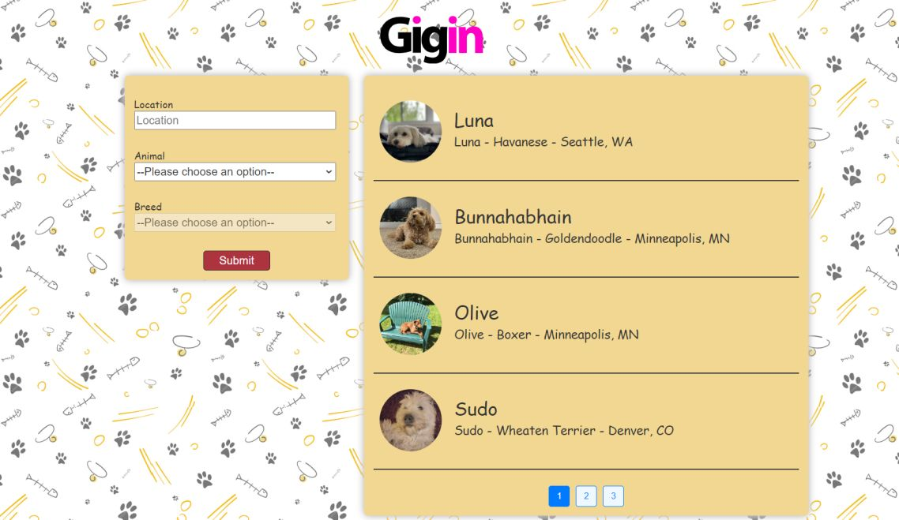
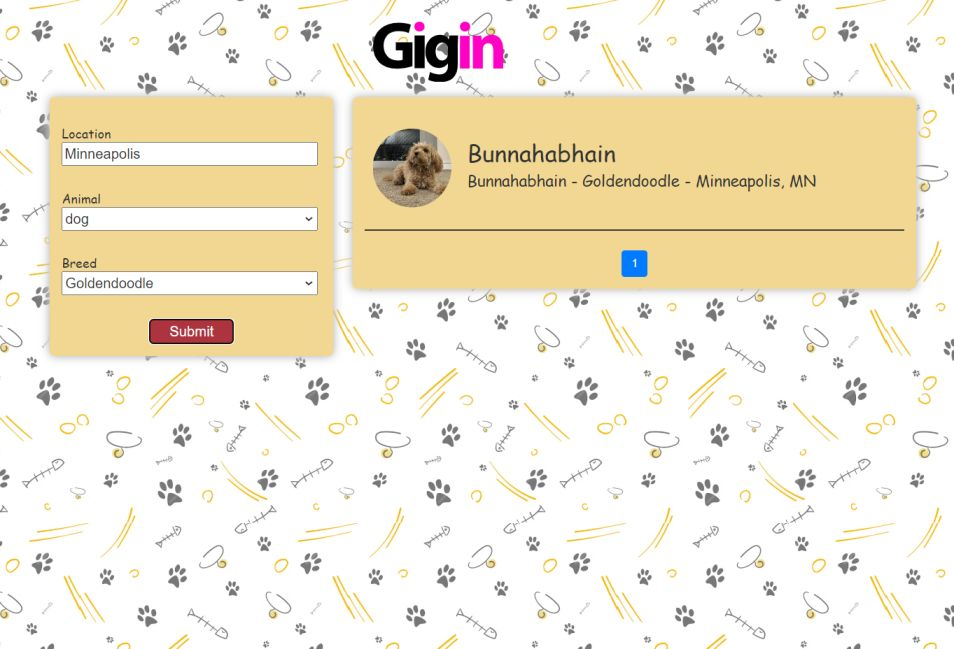
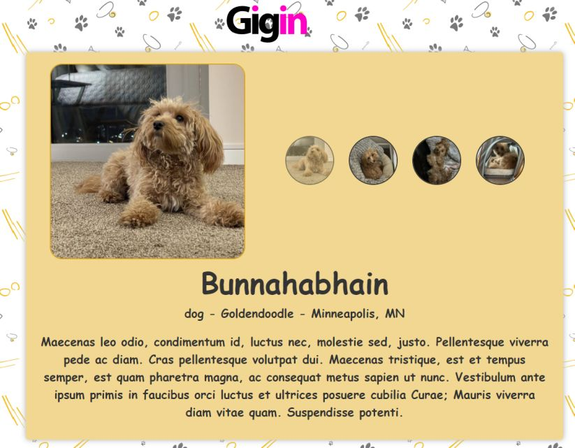

# Pet Listing React Application

This project is a React-based web application for pet-listing. It allows users to search for pets based on animal type, breed, and location, view pet details, and simulate pet listing .

## Application Preview

### Home Page / Search


### Search Results


### Pet Details



## Setup and Running the Project

1. Clone the repository:
git clone https://github.com/Chandan-Kumar-05/pet-listing-main.git
cd pet-Detail-main

2. Install dependencies:
npm install --force

3. Start the development server:
npm run dev

4. Open your browser and navigate to `http://localhost:5173` (or the port specified by Vite).

## Project Structure
```plaintext
pet-Detail-react/
├── src/
│   ├── components/
│   │   ├── Carousel.jsx
│   │   ├── ErrorBoundary.jsx
│   │   ├── LoadingAnimation.jsx
│   │   ├── Modal.jsx
│   │   └── Pet.jsx
│   ├── services/
│   │   ├── fetchBreedList.js
│   │   ├── fetchPet.js
│   │   └── fetchSearch.js
│   ├── utils/
│   │   └── useBreedList.js
│   ├── pages/
│   │   └── AdoptedPetContext.js
│   │   └── Details.jsx
│   │   └── Results.jsx
│   │   └── SearchParams.jsx
│   ├── styles/
│   │   └── styles.css
│   ├── Animation.json
│   ├── App.jsx
├── package.json
└── README.md
```
## Design Decisions

1. **React Query**: We use React Query for data fetching and caching, which provides a smooth user experience and efficient data management.

2. **Context API**: The AdoptedPetContext is used to manage the state of adopted pets across the application.

3. **React Router**: For handling navigation between different views in the application.

4. **Error Boundary**: Implemented to catch and handle errors gracefully, improving the user experience.

5. **Modular Structure**: The project is organized into components, services, and utilities for better maintainability and separation of concerns.

6. **Responsive Design**: The application is designed to be responsive and work well on various screen sizes.

7. **Pagination**: Implemented in the Results component to manage large sets of data efficiently.

8. **Loading Animation**: A custom loading animation is used to provide visual feedback during data fetching.

## Key Components

- **SearchParams**: Main search interface for users to find pets.
- **Results**: Displays search results with pagination.
- **Details**: Shows detailed information about a specific pet.
- **Carousel**: Displays multiple images of a pet in the details view.
- **Modal**: Used for the Detail confirmation process.

## API Integration

The application integrates with a pet Detail API (http://pets-v2.dev-apis.com) for fetching pet data, breed lists, and search functionality.

## Future Improvements

- Implement user authentication and profiles.
- Add favorites functionality for users to save pets they're interested in.
- Enhance the search functionality with more filters and sorting options.
- Implement real-time updates for pet availability.


